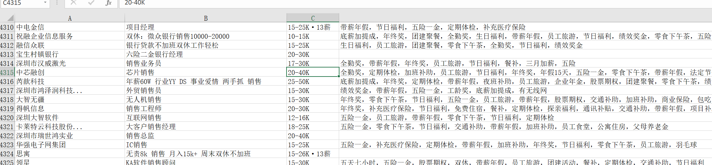

# Boss Spider

Boss直聘爬虫，可爬取Boss直聘公司信息。示例：



## 使用方法

- 安装依赖

```
pip install -r requirements.txt
```

- 启动

```
python boss.py
# 1、运行后会弹出一个chrome浏览器，首次需等待下载drive。
# 2、你有10秒中的时间扫码登录boss直聘
# 3、等待程序完成即可。
```


- 配置文件(config.py)

```python
# 选择需要爬取的职位、城市、以及对应的要求。
# 不需要的已'#'开头注释
jobs = [    # 职位列表，要搜索的职位
    # '外贸业务员',
    '银行',
    '销售',
    '跟单员',
]
citys = {   # 搜索的城市，不喜欢可以注释掉，请统一格式。
    101280600: "深圳",
    101280100: "广州",
    # 101210100: "杭州",
    # 101240100: "南昌",
    # 101240700: "赣州",
}
experience = ",".join([  # 不需要的可以注释掉
    '108',    # 在校生
    '102',    # 应届生
    '101',    # 经验不限
    '103',    # 1年以内
    # '104',    # 1-3年
    # '105',    # 3-5年
    # '106',    # 5-10年
    # '107',    # 10年以上
])

degree = ",".join([  # 学历要求
    # '209',    # 初中及以下
    # '208',    # 中专/中技
    '206',    # 高中
    '202',    # 大专
    '203',    # 本科
    # '204',    # 硕士
    # '205',    # 博士
])

""" 城市列表，需要可以复制到上面citys处
101070300: '鞍山',
101110700: '安康',
101180200: '安阳',
101220600: '安庆',
101260300: '安顺',
101330100: '澳门',
101271900: '阿坝藏族羌族自治州',
101081200: '阿拉善盟',
101140700: '阿里地区',
101131000: '阿克苏地区',
101131500: '阿勒泰地区',
101131700: '阿拉尔',
...
```